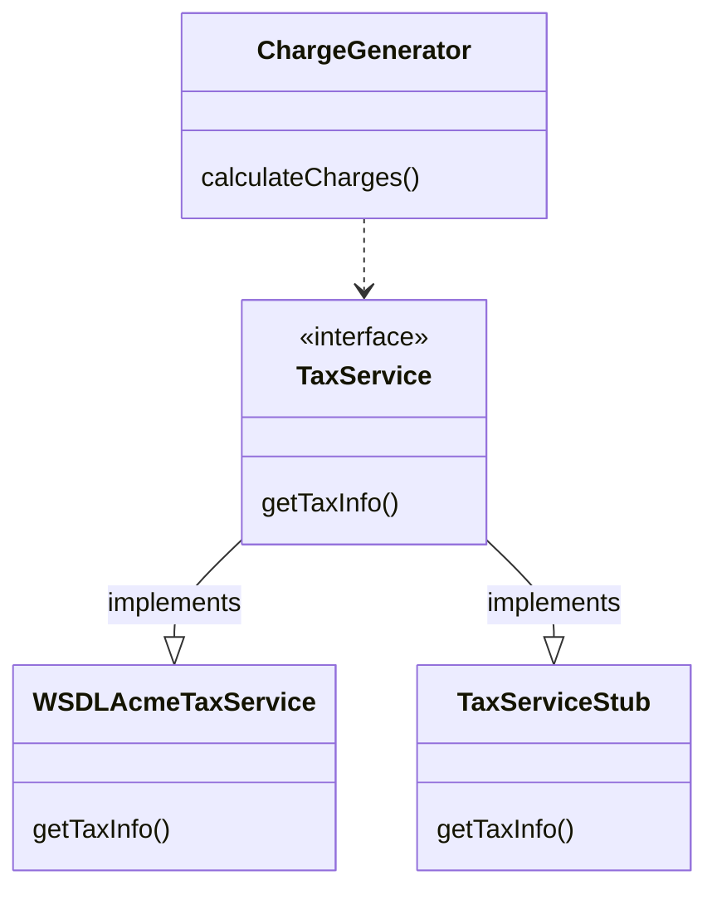
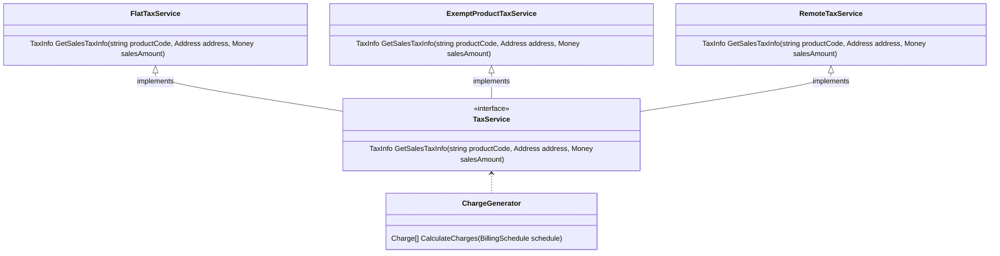

[](https://github.com/kaiosilveira/poeaa-service-stub/actions/workflows/dotnet.yml)

ℹ️ _This repository is part of my "Patterns of Enterprise Application Architecture" (PoEAA) catalog, based on Martin Fowler's book with the same title. For my full work on the topic, see [kaiosilveira/poeaa](https://github.com/kaiosilveira/patterns-of-enterprise-application-architecture)_

---

# Service Stub

Removes dependence upon problematic services during testing.



## Implementation example

Our implementation example follows what's presented in the book and revolves around a `ChargeGenerator` class that uses a remote `TaxService` to fetch its tax rates, based on a product code and the state in which the sale happened. In these situations, it's complex to test the `ChargeGenerator` class due to the external, network-related, unpredictable behavior of the external dependency.

## Implementation considerations

For these cases, it's often useful to rely on an interface that defines the contract between what will come to be the remote service and the consumer of the functionality. In our concrete case, we need to define a `TaxService` interface, which will allow for useful substitution both in testing and development time. With this premise, we can use a **Service Stub** that implements the aforementioned interface in a much simpler fashion, allowing for straightforward initialization of both the stub itself and the SUT (System Under Test) which, in this case, would be a `ChargeGenerator` instance.

The book presents three stubbing examples:

- a `FlatTaxService`, which always returns the same tax rate for every product
- a slightly more elaborate `ExemptProductTaxService`, which contains some pre-defined rules around products that should be exempt from taxes, and
- a fully-fledged `TestTaxService`, which allows consumers to define which products are exempt.

The last example was left out of this implementation, though, as it would require adding some test methods to the main `TaxService` contract, which is often discouraged, considering the modern tooling we have available for stubbing nowadays.

## Implementation details

To start with, we need many supporting classes that are implicit in the example provided in the book but are required to allow our code to work. These classes are `Money`, `BillingSchedule`, `Charge`, `TaxInfo`, and `Address` and will all be omitted from this section. If you're curious about their concrete implementations, please refer to [the example's domain model](./PoEAAServiceStub.Example/Model/).

Now, core to our implementation, we have the `ITaxService` interface itself:

```csharp
public interface ITaxService
{
  public TaxInfo GetSalesTaxInfo(string productCode, Address address, Money saleAmount);
}
```

And its two stubbing implementations, `FlatRateTaxService`:

```csharp
public class FlatRateTaxService : ITaxService
{
  private static readonly decimal FLAT_RATE = 0.05m;

  public TaxInfo GetSalesTaxInfo(string productCode, Address address, Money saleAmount)
  {
    return new TaxInfo(FLAT_RATE, saleAmount * FLAT_RATE);
  }
}
```

and `ExemptProductTaxService`:

```csharp
public class ExemptProductTaxService : ITaxService
{
  private static readonly decimal FLAT_RATE = 0.05m;
  private static readonly decimal EXEMPT_RATE = 0.00m;
  private static readonly string[] EXEMPT_STATES = ["CA", "TX"];
  private static readonly string[] EXEMPT_PRODUCTS = ["12300", "12301"];

  public TaxInfo GetSalesTaxInfo(string productCode, Address address, Money saleAmount)
  {
    return EXEMPT_STATES.Contains(address.State) && EXEMPT_PRODUCTS.Contains(productCode)
        ? new TaxInfo(EXEMPT_RATE, Money.Dollars(0))
        : new TaxInfo(FLAT_RATE, saleAmount * FLAT_RATE);
  }
}
```

These two simple implementations allow for a straightforward testing approach to our `ChargeGenerator`, allowing us to cover the regular case of calculating charges:

```csharp
[Fact]
public void TestCalculatesChargesForSchedule()
{
  var schedule = new BillingSchedule(
      productCode: "ABC123",
      address: new Address(street: "1234 Market St", city: "San Francisco", state: "CA"),
      billingAmount: Money.Dollars(100)
  );

  var chargeGenerator = new ChargeGenerator(taxService: new FlatRateTaxService());
  var charges = chargeGenerator.CalculateCharges(schedule);

  Assert.Equal(2, charges.Length);
  Assert.Equal(Money.Dollars(100), charges[0].Amount);
  Assert.Equal(Money.Dollars(5), charges[1].Amount);
}
```

and also the edge case where a product is exempt from taxes:

```csharp
[Fact]
public void TestConsiderExemptions()
{
  var exemptProductCode1 = "12300";

  var firstSchedule = new BillingSchedule(
      productCode: exemptProductCode1,
      address: new Address(street: "1234 Market St", city: "San Francisco", state: "CA"),
      billingAmount: Money.Dollars(100)
  );

  var chargeGenerator = new ChargeGenerator(taxService: new ExemptProductTaxService());

  var firstCharges = chargeGenerator.CalculateCharges(firstSchedule);
  Assert.Single(firstCharges);
  Assert.Equal(Money.Dollars(100), firstCharges[0].Amount);
}
```

Finally, our `ChargeGenerator` itself looks like this:

```csharp
public class ChargeGenerator(ITaxService taxService)
{
  private readonly ITaxService taxService = taxService;

  public Charge[] CalculateCharges(BillingSchedule schedule)
  {
    var charges = new List<Charge>();
    var baseCharge = new Charge(schedule.BillingAmount);
    charges.Add(baseCharge);

    var info = taxService.GetSalesTaxInfo(
        schedule.ProductCode, schedule.Address, schedule.BillingAmount
    );

    if (info.StateRate > 0)
    {
      var taxCharge = new Charge(info.StateAmount);
      charges.Add(taxCharge);
    }

    return [.. charges];
  }
}
```

In a real-world implementation, we would of course have a `RemoteTaxService` implementation, which would perform remote calls to the tax service and return data following the same contract definition.

Our complete class hierarchy is presented in the diagram below:



And that's it!
